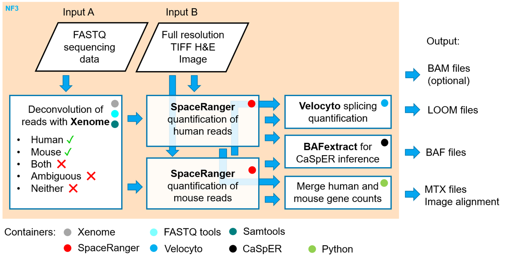
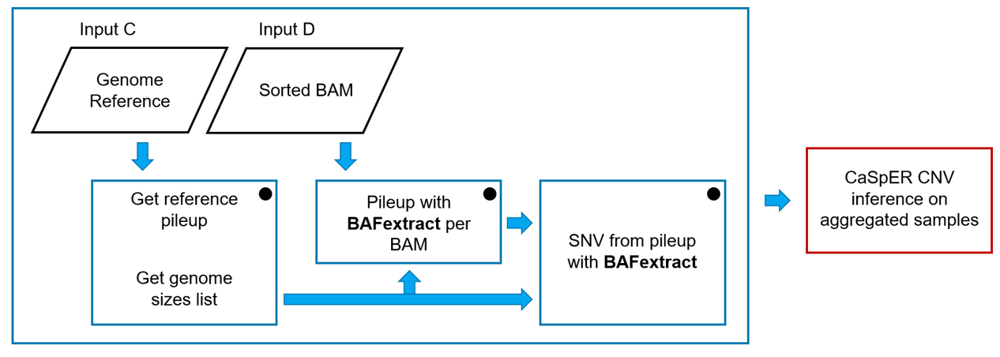

# PDX 10x Visium ST quantification pipeline

- [Overview](#overview)
- [Motivation](#Motivation)
- [Running the piepline](#running-the-piepline)
- [Tools used in the pipeline](#tools-used-in-the-pipeline)
  * fastq-tools
  * xenome
  * spaceranger
  * velocyto
  * bafextract
- [Nextflow pipeline data flow](#nextflow-pipeline-data-flow)
- [Nextflow pipeline resources](#nextflow-pipeline-resources)
- [Glossary of Terms](#glossary-of-terms)

## Overview

This repository contains the source code of the nextflow implementation of the 10x Visium Spatial Gene Expression data processing developed at [The Jackson Laboratory](https://www.jax.org/ "The Jackson Laboratory"). The overview of the pipeline is shown below. The main input consists of compressed FASTQ files and a full-resolution image of the 10x Visium Slide sample. Additional required inputs include Xenome indices, mouse and human reference transcriptomes, and singularity containers with software tools.

    

## Motivation

Most of the steps implemented in our pipeline are computationally expensive and must be carried out on high-performance computer (HPC) systems. The most computationally intensive pipeline steps include RNA-seq reads mapping, full-resolution image alignment, preprocessing for RNA-velocity calculation, and preprocessing for RNA-based CNV inference. The pipeline generates a standardized set of files that can be used on a regular laptop for downstream analysis using R-based Seurat of Python-based Scanpy or any other available environments.

## Running the piepline

##### Prerequisites
+ HPC environment with sufficient CPU and RAM and temporary storage resources

Processing 1 sample requires approximately 50 CPU hours of computing time. Some of the processes need 1 CPU others need 4 CPUs or 8 CPUs as specified in the `nexflow.config` file. The temporary storage requires roughly 250 GB per sample for the pipeline to run. For example, if 32 samples are processed simultaneously, about 8TB of storage will be used until the pipeline completes.

+ Nextflow 

      https://www.nextflow.io/docs/latest/getstarted.html#installation

+ Singularity 

      https://docs.sylabs.io/guides/3.0/user-guide/installation.html

+ The pipeline source code  (this repository)

	  mkdir my-piepline-run
      cd my-piepline-run
	  git clone https://github.com/TheJacksonLaboratory/PDX-st-quantification.git
      cd PDX-st-quantification

+ Singularity software containers used in this pipeline

The singularity containers used in our pipeline can be downloaded or built with the definition `*.def` files and recipes contained in the directory `assets`.

+ Reference genomes for mouse and human (see tool `spaceranger count` below)

+ Deconvolution indices (see tool `xenome classify` below)

##### Sample sheet

The pipeline is designed to take one or more samples and process them in parallel. The sample sheet must have a `csv` format and must contain a header as shown below:

| sample | fastq | image |
|------|------|------|
| sample_A   | path/to/sample1/fatqs/   | path/to/fullres/image1.tiff    |
| sample_B   | path/to/sample2/fatqs/   | path/to/fullres/image2.tiff    |
| sample_C   | path/to/sample3/fatqs/   | path/to/fullres/image3.tiff    |
| ...  | ...  | ...  |

> ***Tip*** Column headers may be named differently but preserving the order, i.e. the first column contains sample identifiers, the second column points to a path of directories where the sample fastq files are stored, the third column points to a path of directories where the sample image is stored.

> ***Tip*** Sample identifiers in column 1 must be unique. The output directory will contain sub-directories named by the sample identifiers. The pipeline output reports are also based on these identifiers.

> ***Note*** The fastq files are expected to be compressed `fastq.gz` paired-end reads. Two files are expected in the fastq directory.

##### Configure the pipeline

Edit file `nextflow.config` to specify paths to singularity containers, reference genome sequences, and deconvolution indices. If necessary, adjust any of the resources allowed to be consumed by processes.

Check the defaults or edit the file `conf/analysis.config` to adjust any customizable parameters.

Edit file `run.sh` to modify the three lines:
+ samplesheet="/path/to/samplesheet.csv"
+ workdir="/fastscratch/[jaxuser]/some_work_run"
+ outdir="/path/to/results_my_analysis"

> ***Tip*** Use unique paths for each run to make the cleanup of temporary files easier. This strategy allows the separation of pipeline run statistics and output samples.

> ***Note*** `workdir` must point to a device with a large storage volume and fast I/O access capability.

##### Run the pipeline

        ./run.sh

The command above submits the pipeline to the HPC slurm system, which creates a low resource but long wall time job which manages the nextflow pipeline run. Nextflow manages all the pipeline processes and monitors the execution progress. Users can periodically monitor the contents of the `slurm-*.out` file to see progress.

> ***Tip*** Submitting via srun interactive session will show beautifully updated progress of the pipeline run. We do not recommend using srun for our pipeline, since network interruption will cause the ssh connection to drop and the pipeline to fail. In such an unfortunate case user can run the pipeline again, however, any previously unfinished processes will restart, while all finished processes resume from cached data.

## Tools used in the pipeline

1. **`fastq-tools`** (https://github.com/dcjones/fastq-tools)

2. **`xenome classify`** (https://github.com/data61/gossamer)

> Conway T, Wazny J, Bromage A, et al. Xenome--a tool for classifying reads from xenograft samples. Bioinformatics (Oxford, England). 2012 Jun;28(12):i172-8. DOI: 10.1093/bioinformatics/bts236. PMID: 22689758; PMCID: PMC3371868.

`xenome classify` is designed to classify xenograft-derived RNA-seq reads to deconvolve the graft (human) from the host (mouse) reads. Xenome defines classes of reads: definitely human, probably human, definitely mouse, probably mouse, both, ambiguous, neither. In xenome classes definitely human and probably human are combined into human; classes definitely mouse and probably mouse are combined into mouse. We discard reads classified as both, ambiguous, or neither. The statistics of Xenome reads deconvolution is generated in the sample output directory in file `xenome.summary.txt`.

`xenome classify` requires indices generated by `xenome index` as an input. The indices used in out analysis were built with `-K 25`, `-H ensembl/v102/Mus_musculus.GRCm38.dna.primary_assembly.fa` and `-G T2T-CHM13v2.0/assembly/GCA_009914755.4_T2T-CHM13v2.0_genomic.fna`.

3. **`spaceranger count`** (https://support.10xgenomics.com/spatial-gene-expression/software/pipelines/latest/using/count) is a pipeline developed by 10x Genomics based on a Martian pipeline (https://martian-lang.org/). 

> Martian pipeline is implemented in GOYACC (https://pkg.go.dev/golang.org/x/tools/cmd/goyacc), i.e. YACC (Yet Another Compiler-Compiler) for GO (https://go.dev/). We build `spaceranger count` pipeline into our pipeline as a nextflow process. 

`space ranger count` is designed to process one capture area of a Visium Spatial Gene Expression Slide for fresh frozen (FF) and formalin fixed paraffin embedded FFPE tissue samples. We use automatic capture area image alignment, where fiducials and the grid is detected by SpaceRanger. Note, the image alignment is independent of the reference transcriptome or any sequencing parameters. The image alignment result are generated in the sample output folder under `spatial` and contains six files:
+ `aligned_fiducials.jpg`
+ `detected_tissue_image.jpg`
+ `scalefactors_json.json`
+ `tissue_hires_image.png`
+ `tissue_lowres_image.png`
+ `tissue_positions_list.csv`

Space Ranger requires the mouse and human reference genomes as input. These can be downloaded from the 10x Genomics website:

    wget https://{get-url-at-10x-genomics-website}/refdata-gex-GRCh38-2020-A.tar.gz
    wget https://{get-url-at-10x-genomics-website}/refdata-gex-mm10-2020-A.tar.gz

and unpacked to create two directories `refdata-gex-GRCh38-2020-A` and `refdata-gex-mm10-2020-A`:

    tar -xf refdata-gex-GRCh38-2020-A.tar.gz
    tar -xf refdata-gex-mm10-2020-A.tar.gz

> ***Note*** Both unpacked reference genomes take 45GB of storage space in total.

The Xenome-classified mouse reads alignment to the reference transcriptome is done using mouse reference, and the Xenome-classified human reads alignment to the reference transcriptome is done using human reference. The output mouse and human gene count matrices in the MTX format are merged into one and generated as output in the sample folder under `raw_feature_bc_matrix`. The "raw" means that all 4992 ST spots are present in the matrix. Summaries of the human and mouse read quantification are generated in the `human` and `mouse` directories of the sample output directory.
 
4. **`velocyto run10x`** (http://velocyto.org/velocyto.py/index.html)

Velocyto is run for all 4992 spots using the human or mouse genome reference and barcode-sorted BAM file. The latter is generated from a possorted BAM file which is the output from `spaceranger count`. The output is a `human/velocyto.loom` and `mouse/velocyto.loom` in the sample output directory. The `*.loom` files can be loaded with `velocyto.py` or `scvelo` (https://scvelo.readthedocs.io/) or other compatible toolsets for analysis of RNA-velocity.

> To learn more about RNA velocity see: La Manno, G., Soldatov, R., Zeisel, A. et al. RNA velocity of single cells. Nature 560, 494-498 (2018). https://doi.org/10.1038/s41586-018-0414-6

> ***Note*** Analysis of the spliced/unspliced RNA counts generated in our pipeline is outside the scope of this pipeline and is carried out in the downstream steps.

5. **`BAFextract`** (https://github.com/akdess/CaSpER)

BAFextract is a tool designed by the authors of CaSpER, and is intended to extract B-allele frequencies (BAF) from BAM files in order to estimate CNV events in the downstream steps with CaSpER.

> To learn about CaSpER see: Serin Harmanci, A., Harmanci, A.O. & Zhou, X. CaSpER identifies and visualizes CNV events by integrative analysis of single-cell or bulk RNA-sequencing data. Nat Commun 11, 89 (2020). https://doi.org/10.1038/s41467-019-13779-x

BAFextract includes DNA scaffolds and mitochondrion (MT) DNA if those are present in the species genome reference. The output is a file `extracted.baf` generated in the human and mouse sub-directories of the sample output directory.

The schema of using BAFextract in our pipeline is depicted below:

    

> ***Note*** CaSpER RNA-based CNV-inference is outside the scope of this pipeline and is carried out in the downstream steps.

## Nextflow pipeline data flow

Execution of the pipeline and flow of data through processes enable generating the Directed Acyclic Graph (DAG). The inputs and outputs are interconnected with the logic encoded by or nextflow pipeline.

    

> ***Note*** DAG is generated during each pipeline run and is determined by the configuration and input parameters of the pipeline. For example, if certain optional processes are toggled "off" then those processes and relevant graph connections will not show in the DAG.

## Nextflow pipeline resources

Our pipeline enables detailed tracing of resource usage. The run HTML report in the `pipeline_info` directory contains the time and resources spent by each process and each sample.

Example of CPU usage by various processes in the pipeline. A screenshot from the HTML report shows that SPACERANGER_HUMAN was the most CPU-intensive step in this example run:

    

#### Glossary of Terms:
+ HPC - High-performance computer
+ BAM - Binary sequence alignment map
+ CNV - Copy number variation
+ BAF - B-allele frequency
+ ST - Spatial Transcriptomics;
+ Full-resolution image - capture area image supplied to SpaceRanger, e.g. 30000 x 30000 pixels;
+ Low-resolution image - downsampled full-resolution capture area image, e.g. 600 x 600 pixels;
+ High-resolution image - downsampled full-resolution capture area image, e.g. 2000 x 2000 pixels;
