# Nextflow Pipeline for Visium and H&E Data Processing

**Publication citation:**
> Domanskyi S, Srivastava A, Kaster J, Li H, Herlyn M, Rubinstein JC, Chuang JH. Nextflow pipeline for Visium and H&E data from patient-derived xenograft samples. Cell Rep Methods. 2024 May 20;4(5):100759. doi: 10.1016/j.crmeth.2024.100759. Epub 2024 Apr 15. PMID: 38626768; PMCID: PMC11133696.

**Associated data and source code DOI:**
> 1. Domanskyi, S., Srivastava, A., Kaster, J., Li, H., Herlyn, M., Rubinstein, J. C., & Chuang, J. H. (2024). Nextflow Pipeline for Visium and H&E Data from Patient-Derived Xenograft Samples (v0.2.0). Zenodo. https://doi.org/10.5281/zenodo.10839655

> 2. Domanskyi, S., Srivastava, A., Kaster, J., Li, H., Herlyn, M., Rubinstein, J. C., & Chuang, J. H. (2024). WM4237 TE histology images, H&E stain [Data set]. Zenodo. https://doi.org/10.5281/zenodo.12746982

> 3. Domanskyi, S. (2024). Demo 10x Visium dataset for STQ [Data set]. Zenodo. [https://doi.org/10.5281/zenodo.10654467](https://doi.org/10.5281/zenodo.10654467)

- [Overview](#overview)
- [Motivation](#Motivation)
- [Documentation](#Documentation)
- [Output](#Output)
- [Running the piepline](#running-the-piepline)
- [Tools used in the pipeline](#tools-used-in-the-pipeline)
  * fastq-tools
  * xenome
  * spaceranger
  * velocyto
  * bafextract
  * Inception v3
  * CTransPath, UNI, CONCH
  * HoVer-Net
  * Stardist
  * DeepFocus
  * scanpy
- [Nextflow pipeline data flow](#nextflow-pipeline-data-flow)
- [Nextflow pipeline resources](#nextflow-pipeline-resources)
- [Glossary of Terms](#glossary-of-terms)

## Routes of analysis

    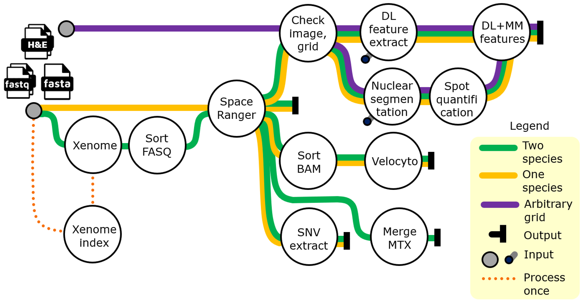

## Overview

This repository contains the source code of the nextflow implementation of the 10x Visium Spatial Gene Expression data and full-resolution H&E-stained Whole Slide Images (WSI) processing developed at [The Jackson Laboratory](https://www.jax.org/ "The Jackson Laboratory"). The overview of the pipeline is shown above. The primary input consists of compressed FASTQ files, reference FASTA files, and a full-resolution image of the 10x Visium Slide sample. Additional required inputs include either pre-built Xenome indices or host and graft genome assemblies, mouse and human reference transcriptomes for reads mapping, DL pre-trained model weights, and singularity containers with software tools.

## Motivation

Most of the steps implemented in our pipeline are computationally expensive and must be carried out on high-performance computer (HPC) systems. The most computationally intensive pipeline steps include RNA-seq reads mapping, full-resolution image alignment, preprocessing for RNA-velocity calculation, and preprocessing for RNA-based CNV inference, deep learning imaging features, and nuclear morphometrics data extraction. The pipeline generates a standardized set of files (see Section "Output") that can be used for downstream analysis using R-based Seurat of Python-based Scanpy or any other available environments. The pipeline can be used with a variety of formats of stand-alone WSI to perform conversion and handling image QC, focus checking, stain normalization, nuclear segmentation, and feature extraction.

## Documentation

The description of the pipeline components, parameters, analysis routes, required resources, and configuration guide are provided in this repository. The documentation files are [README.md](README.md), [conf/README.md](conf/README.md), and [workflows/README.md](workflows/README.md).

## Running the piepline

Animated workflow steps

Summary of all workflow steps

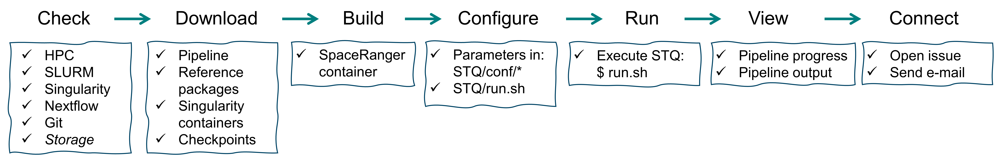

 

##### Demo data

Once the pipeline and all the prerequisite software are installed, the demo can be executed on a small dataset (https://zenodo.org/records/10654467). To get a copy of the data, modify the `savePath` below to a meaningful location on your computing system and execute the lines. We recommend using an absolute path since it is required to generate a proper samplesheet file. Modify the STQ run.sh file to point input samplesheet to `samplesheet_demo_local.csv`. Demo run is a good test that the software is installed properly and can take approximately 30 minutes to complete.

    savePath="/path/to/save/demodata"

    cd $savePath
    wget https://zenodo.org/records/10654467/files/SC2200092.tiff
    wget https://zenodo.org/records/10654467/files/fastq.tar
    tar -xvf fastq.tar

    echo -e "sample,fastq,image,grid,roifile,mpp\nDemo_S1,${savePath}/fastq/,${savePath}/SC2200092.tiff,,,0.22075" > samplesheet_demo_local.csv

 

##### Installation
+ HPC environment with sufficient CPU and RAM and storage resources

Processing 1 sample requires approximately 100+ CPU hours of computing time. Some of the processes need 1 CPU others need 4 CPUs or 8 CPUs as specified in the `nexflow.config` file. The temporary storage requires roughly 250 GB per sample for the pipeline to run. For example, if 32 samples are processed simultaneously, about 8TB of storage will be used until the pipeline completes.

+ Nextflow 

      # https://www.nextflow.io/docs/latest/getstarted.html#installation

      wget -qO- https://get.nextflow.io | bash
      chmod +x nextflow
      mv nextflow ~/bin

+ Singularity 

      https://docs.sylabs.io/guides/3.0/user-guide/installation.html

+ Git (most likely it is already available on your system)

      # https://git-scm.com/
      # On Debian one can install git with

      apt-get install -y git

+ Get the pipeline source code (this repository)

      mkdir my-piepline-run
      cd my-piepline-run
      git clone https://github.com/TheJacksonLaboratory/STQ.git
      cd STQ

+ Singularity software containers used in this pipeline

The singularity containers used in our pipeline can be downloaded or built with the definition `*.def` files and recipes contained in the directory `assets`.

> ***Note*** 10x Genomics requires that any software containers with Space Ranger are not shared publicly. We provide an example of a definition file for building a Space Ranger container with singularity: [assets/container-singularity-spaceranger.def](conf/container-singularity-spaceranger.def) that pulls a standard `debian:buster-slim` container from docker and installs all necessary Linux libraries. After that, a copy of Space Ranger is downloaded and installed from the 10x Genomics download portal. To obtain a download link for a specific version of Space Ranger user must navigate to https://www.10xgenomics.com/support/software/space-ranger/downloads, register, review, and accept any required user agreements from 10x, and copy the download link. Next, paste the link to a copy of the `def` file. Finally, build a container with any desired resource, for example, https://cloud.sylabs.io/builder.

Click to see the commands used to upload singularity-built containers to quay.io

    singularity remote login -u <user> docker://quay.io

    singularity push /projects/chuang-lab/USERS/domans/containers/local/mamba-xenomake.sif oras://quay.io/jaxcompsci/xenomake:v1.0.0
    singularity push /projects/chuang-lab/USERS/domans/containers/container-mamba-inception.sif oras://quay.io/jaxcompsci/inception:v1.0.0
    singularity push /projects/chuang-lab/USERS/domans/containers/local/container-singularity-hovernet-py.sif oras://quay.io/jaxcompsci/hovernet:v2.0.0
    singularity push /projects/chuang-lab/USERS/domans/containers/container-singularity-stainnet.sif oras://quay.io/jaxcompsci/stainnet:v1.0.0
    singularity push /projects/chuang-lab/USERS/domans/containers/container-singularity-staintools.sif oras://quay.io/jaxcompsci/staintools:v1.0.0
    singularity push /projects/chuang-lab/USERS/domans/containers/container-singularity-vips.sif oras://quay.io/jaxcompsci/vips:v1.0.0
    singularity push /projects/chuang-lab/USERS/domans/containers/container-singularity-fastqtools.sif oras://quay.io/jaxcompsci/fastqtools:v1.0.0
    singularity push /projects/chuang-lab/USERS/domans/containers/container-singularity-bafextract.sif oras://quay.io/jaxcompsci/bafextract:v1.0.0
    singularity push /projects/chuang-lab/USERS/domans/containers/container-singularity-velocyto.sif oras://quay.io/jaxcompsci/velocyto:v1.0.0
    singularity push /projects/chuang-lab/USERS/domans/containers/container-singularity-python.sif oras://quay.io/jaxcompsci/pythonlow:v1.0.0
    singularity push /projects/chuang-lab/USERS/domans/containers/deepfocus.sif oras://quay.io/jaxcompsci/deepfocus:v1.0.0
    singularity push /projects/chuang-lab/USERS/domans/containers/local/ome.sif oras://quay.io/jaxcompsci/ome:v1.0.0
    singularity push /projects/chuang-lab/USERS/domans/containers/local/mamba-timm.sif oras://quay.io/jaxcompsci/timm:v1.0.0
    singularity push /projects/chuang-lab/USERS/domans/containers/hf-uni-conch.sif oras://quay.io/jaxcompsci/hfconch:v1.0.0

To download containers for use with the pipeline: change directory to the desirable download location and run the commands below:

    singularity pull docker://quay.io/jaxcompsci/xenome:1.0.1
    singularity pull oras://quay.io/jaxcompsci/xenomake:v1.0.0
    singularity pull oras://quay.io/jaxcompsci/inception:v1.0.0
    singularity pull oras://quay.io/jaxcompsci/hovernet:v2.0.0
    singularity pull oras://quay.io/jaxcompsci/stainnet:v1.0.0
    singularity pull oras://quay.io/jaxcompsci/staintools:v1.0.0
    singularity pull oras://quay.io/jaxcompsci/vips:v1.0.0
    singularity pull oras://quay.io/jaxcompsci/fastqtools:v1.0.0
    singularity pull oras://quay.io/jaxcompsci/bafextract:v1.0.0
    singularity pull oras://quay.io/jaxcompsci/velocyto:v1.0.0
    singularity pull oras://quay.io/jaxcompsci/pythonlow:v1.0.0
    singularity pull oras://quay.io/jaxcompsci/deepfocus:v1.0.0
    singularity pull oras://quay.io/jaxcompsci/ome:v1.0.0
    singularity pull oras://quay.io/jaxcompsci/timm:v1.0.0
    singularity pull oras://quay.io/jaxcompsci/hfconch:v1.0.0

Click to get a template for conf/containers.config file:

    container_inception        = "${params.container_dir}/inception_v1.0.0.sif"
    container_hovernet         = "${params.container_dir}/hovernet_v2.0.0.sif"
    container_stainnet         = "${params.container_dir}/stainnet_v1.0.0.sif"
    container_staintools       = "${params.container_dir}/staintools_v1.0.0.sif"
    container_vips             = "${params.container_dir}/vips_v1.0.0.sif"
    container_xenome           = "${params.container_dir}/xenome_v1.0.1.sif"
    container_xengsort         = "${params.container_dir}/xenomake_v1.0.0.sif"
    container_fastqtools       = "${params.container_dir}/fastqtools_v1.0.0.sif"
    container_spaceranger      = "${params.container_dir}/spaceranger_v1.0.0.sif"
    container_bafextract       = "${params.container_dir}/bafextract_v1.0.0.sif"
    container_python           = "${params.container_dir}/python_v1.0.0.sif"
    container_velocyto         = "${params.container_dir}/velocyto_v1.0.0.sif"
    container_deepfocus         = "${params.container_dir}/deepfocus_v1.0.0.sif"
    container_ome              = "${params.container_dir}/ome_v1.0.0.sif"
    container_timm             = "${params.container_dir}/timm_v1.0.0.sif"
    container_conch             = "${params.container_dir}/hfconch_v1.0.0.sif"

+ Reference packages for mouse and human (see tool `spaceranger count` below).

+ Custom graft and host reference FASTA files to use with reads classification tools.

+ If you plan to use StainNet within the pipeline, download the checkpoint from: 

      wget https://github.com/khtao/StainNet/blob/master/checkpoints/aligned_histopathology_dataset/StainNet-Public_layer3_ch32.pth

##### Samplesheet

The pipeline is designed to take one or more samples and process them in parallel. The sample sheet must have a `csv` format and must contain a header, as shown below:

| sample | fastq | image | grid | roifile | mpp |
|--------|-------|-------|------|---------|-----|
| sample_A   | path/to/sample1/fatqs/   | path/to/fullres/image1.tiff    |  |  | 0.22075 |
| sample_B   | path/to/sample2/fatqs/   | path/to/fullres/image2.tiff    |  |  | 0.22075 |
| sample_C   | path/to/sample3/fatqs/   | path/to/fullres/image3.tiff    |  |  | 0.22075 |
| ...    | ...   | ...   | ...  | ...     | ... |

> ***Tip*** Column headers must be named as shown above but not necessarily preserve the order, except that the first column must contain the sample identifiers. Even if a certain column is not necessary for a certain pipeline run, that column must be present in the CSV with an empty value, e.g., if roifile is left blank, then the entire WSI image is used in the analysis.

> ***Tip*** Sample identifiers in column 1 must be unique. The output directory will contain sub-directories named by the sample identifiers. The pipeline output reports are also based on these identifiers.

> ***Note*** The fastq files are expected to be compressed `fastq.gz` paired-end reads. Two files are expected in the fastq directory.

The column "grid" points to a path of directories where the sample spatial image alignment is stored. The value in the column "grid" can be empty if the WSI is not from the 10x Visium Spatial Gene Expression Slide or Space Ranger image alignment was not done.

The column "roifile" is used to specify the path to a JSON file that contains information on how to crop the WSI for processing in the imaging sub-workflow. Note that the sequencing sub-workflow image must contain the slide fiducials for Space Ranger to align the image and grid. When using a grid from the sequencing sub-workflow roifile value is ignored.

The column "mpp" is used to specify WSI resolution in microns per pixel. The recommended resolution of images that can be used with the imaging sub-workflow is approximately 0.25 microns per pixel. Images are downsampled or upsampled to the pre-specified in the configuration target mpp value.

##### Configure the pipeline

Edit any (or all) of the files in `conf` to specify paths to containers, reference genome sequences, deconvolution indices and analysis parameters. See description of the analysis parameters in [conf/README.md](conf/README.md).

For JAX users, preparation of the pipeline can be done by editing the file `run.sh` and modifying the following lines:
+ workflow="two_references" ### "two_references" "one_reference" "arbitrary_grid" "deconvolution_indices"
+ samplesheet="/path/to/samplesheet.csv"
+ workdir="/flashscratch/[jaxuser]/some_work_run"
+ outdir="/path/to/results_my_analysis"

> ***Tip*** Use unique paths for "workdir" and "outdir" for each pipeline run to make the cleanup of temporary files easier. This strategy also allows the separation of pipeline run statistics and output samples.

> ***Note*** `workdir` must point to a device with a large storage volume and fast I/O access capability, e.g. flashscratch or fastscratch for JAX users.

##### Run the pipeline

If the "two_references" workflow will be used, first generate the xenome/xengsort index files: edit `run.sh` to specify the workflow "deconvolution_indices", and execute as exemplified below, in the detached mode.

> ***Note*** The workflow "deconvolution_indices" takes about 10 min for "xengsort", and 60 min for "xenome".

###### Detached mode (preferred)

Use any HPC node and submit the script to slurm:

       cd my-piepline-run/STQ/
       run.sh

In this detached mode, the above command submits the pipeline to the HPC slurm system, which creates a low resource but long wall time job (duration specified in the submit.sb file), which manages the nextflow pipeline run. Nextflow manages all the pipeline processes and monitors the execution progress. Users can periodically monitor the contents of the `slurm-*.out` file to see progress:

       tail -n 50 slurm-<your_job_id>.out

###### Interactive mode (this mode use is discouraged)

On an HPC, start an interactive session, edit "run.sh" to remove word "sbatch" and run the script:

        srun -p compute -q batch -t 6:00:00 --cpus-per-task=1 --mem=2G -J ijob --pty /bin/bash
        cd my-piepline-run/STQ/
        run.sh

> ***Note*** The exemplified command above requests 6 hours of wall-time; this can be adjusted to a specific necessary run time.

> ***Tip*** Submitting via srun interactive session will show interactively updated progress of the pipeline run. We do not recommend using srun for our pipeline since any network interruption will cause the ssh connection to drop and the pipeline to fail. In such a case user can rerun the pipeline. However, any previously unfinished processes will restart, while all finished processes resume from cached data.

## Output

Example output directory structure is shown below. Directories are highlighted in bold. "pipeline_info" contains the reports of used resources, execution timeline and identifiers of the temporary directories.
For each row in the samplesheet (except the header) there is a directory in the output, e.g., **WM4237_TE_S1_ST** below, containing gene expression matrix, spatial image registration data, reads classification, RNA velocity data, and H&E quantification data. Depending on the pipeline parameters, some of the files listed below may not be generated, e.g., when a ceratin tool or subworkflow is turned off.

<pre>
.
├── <b>pipeline_info</b>
│   ├── <i>parameters.json</i>
│   ├── <i>execution_report_2024-02-09_10-57-36.html</i>
│   ├── <i>execution_timeline_2024-02-09_10-57-36.html</i>
│   ├── <i>execution_trace_2024-02-09_10-57-36.txt</i>
│   └── <i>pipeline_dag_2024-02-09_10-57-36.svg</i>
│
└── <b>WM4237_TE_S1_ST</b>
    ├── <b>raw_feature_bc_matrix</b>
    │   ├── barcodes.tsv.gz
    │   ├── features.tsv.gz
    │   └── matrix.mtx.gz
    ├── <b>spatial</b>
    │   ├── aligned_fiducials.jpg
    │   ├── detected_tissue_image.jpg
    │   ├── scalefactors_json.json
    │   ├── tissue_hires_image.png
    │   ├── tissue_lowres_image.png
    │   └── tissue_positions_list.csv
    │
    ├── xenome.summary.txt
    ├── <b>human</b>
    │   ├── extracted.baf
    │   ├── metrics_summary.csv
    │   ├── velocyto.loom
    │   └── web_summary.html
    ├── <b>mouse</b>
    │   ├── extracted.baf
    │   ├── metrics_summary.csv
    │   ├── velocyto.loom
    │   └── web_summary.html
    │
    ├── <b>grid</b>
    │   ├── grid.csv
    │   └── grid.json
    ├── <b>mask</b>
    │   ├── pixel_mask.csv
    │   ├── tile_mask.csv
    │   ├── tile_mask.png
    │   └── tissue_mask.png
    ├── <b>focus</b>
    │   ├── outfile.tiff-f289868-o24116.csv
    │   ├── outfile.tiff-f289868-o24116.png
    │   └── outfile.tiff.tissue.png
    ├── <b>features</b>
    │   ├── false-1-ctranspath_features.tsv.gz
    │   └── ...
    ├── <b>nucseg</b>
    │   ├── outfile.json.gz
    │   ├── per_nucleus_data.csv.gz
    │   ├── per_nucleus_data.csv.gz.csv
    │   └── per_spot_data.csv
    ├── <b>tiles</b>
    │   ├── classes.csv.gz
    │   ├── tile-00002793.png
    │   └── ...
    ├── <b>figures</b>
    │   ├── cluster.png
    │   ├── spatial_plot_classification.png
    │   ├── spatial_plot_morphometric.png
    │   ├── umap_plot_classification.png
    │   ├── umap_plot_cluster.png
    │   └── umap_plot_morphometric.png
    |
    ├── thumbnail.jpeg
    ├── thumbnail.tiff
    ├── image.ome.tiff
    ├── img.data.ctranspath-2.h5ad
    ├── metadata.ome.xml
    ├── roi.json
    └── run.json
</pre>

## Tools used in the pipeline

1. **`fastq-tools`** (https://github.com/dcjones/fastq-tools)

2. (A). **`xenome classify`** (https://github.com/data61/gossamer)

> Conway T, Wazny J, Bromage A, et al. Xenome--a tool for classifying reads from xenograft samples. Bioinformatics (Oxford, England). 2012 Jun;28(12):i172-8. DOI: 10.1093/bioinformatics/bts236. PMID: 22689758; PMCID: PMC3371868.

`xenome classify` is designed to classify xenograft-derived RNA-seq reads to deconvolve the graft (human) from the host (mouse) reads. Xenome defines classes of reads: definitely human, probably human, definitely mouse, probably mouse, both, ambiguous, neither. In xenome classes definitely human and probably human are combined into human; classes definitely mouse and probably mouse are combined into mouse. We discard reads classified as both, ambiguous, or neither. The statistics of Xenome reads deconvolution is generated in the sample output directory in file `xenome.summary.txt`.

`xenome classify` requires indices generated by `xenome index` as an input. The indices used in our analysis were built with `-K 35`, `-H Custom_Genomes/R84-REL1505/NOD_ShiLtJ/NOD_ShiLtJ.fa`, and `-G GCA_009914755.4_T2T-CHM13v2.0_genomic.fna`.

2. (B). **`xengsort classify`** (https://gitlab.com/genomeinformatics/xengsort) 

`xengsort` is conceptually similar to xenome, however, engeneered to be faster and more efficient using Numba JIT and Python.

> Zentgraf J, Rahmann S. Fast lightweight accurate xenograft sorting. Algorithms Mol Biol. 2021 Apr 2;16(1):2. doi: 10.1186/s13015-021-00181-w. PMID: 33810805; PMCID: PMC8017614.

3. **`spaceranger count`** (https://support.10xgenomics.com/spatial-gene-expression/software/pipelines/latest/using/count) is a pipeline developed by 10x Genomics based on a Martian pipeline (https://martian-lang.org/). 

> Martian pipeline is implemented in GOYACC (https://pkg.go.dev/golang.org/x/tools/cmd/goyacc), i.e., YACC (Yet Another Compiler-Compiler) for GO (https://go.dev/). We build `spaceranger count` pipeline into our pipeline as a nextflow process. 

`spaceranger count` is designed to process one capture area of a Visium Spatial Gene Expression Slide for fresh frozen (FF) and formalin fixed paraffin embedded FFPE tissue samples. We use automatic capture area image alignment, where fiducials and the grid are detected by SpaceRanger. Note the image alignment is independent of the reference transcriptome or any sequencing parameters. The image alignment result is generated in the sample output folder under `spatial` and contains six files:
+ `aligned_fiducials.jpg`
+ `detected_tissue_image.jpg`
+ `scalefactors_json.json`
+ `tissue_hires_image.png`
+ `tissue_lowres_image.png`
+ `tissue_positions_list.csv`

Space Ranger requires the mouse, human, or combined reference genomes as input. These can be downloaded from the 10x Genomics website:

    wget https://cf.10xgenomics.com/supp/cell-exp/refdata-gex-GRCh38-2020-A.tar.gz
    wget https://cf.10xgenomics.com/supp/cell-exp/refdata-gex-mm10-2020-A.tar.gz
    wget https://cf.10xgenomics.com/supp/cell-exp/refdata-gex-GRCh38-and-mm10-2020-A.tar.gz

and unpacked to create two directories, `refdata-gex-GRCh38-2020-A` and `refdata-gex-mm10-2020-A`:

    tar -xf refdata-gex-GRCh38-2020-A.tar.gz
    tar -xf refdata-gex-mm10-2020-A.tar.gz
    tar -xf refdata-gex-GRCh38-and-mm10-2020-A.tar.gz

> ***Note*** Each unpacked reference genome takes about 20 GB of storage space.

The Xenome-classified mouse reads alignment to the reference transcriptome is done using mouse reference, and the Xenome-classified human reads alignment to the reference transcriptome is done using human reference. The output mouse and human gene count matrices in the MTX format are merged into one and generated as output in the sample folder under `raw_feature_bc_matrix`. The "raw" means that all 4992 ST spots are present in the matrix. Summaries of the human and mouse read quantification are generated in the `human` and `mouse` directories of the sample output directory.
 
4. **`velocyto run10x`** (http://velocyto.org/velocyto.py/index.html)

Velocyto is run for all 4992 spots using the human or mouse genome reference and barcode-sorted BAM file. The latter is generated from a possorted BAM file which is the output from `spaceranger count`. The output is a `human/velocyto.loom` and `mouse/velocyto.loom` in the sample output directory. The `*.loom` files can be loaded with `velocyto.py` or `scvelo` (https://scvelo.readthedocs.io/) or other compatible toolsets for analysis of RNA-velocity.

> To learn more about RNA velocity, see: La Manno, G., Soldatov, R., Zeisel, A. et al. RNA velocity of single cells. Nature 560, 494-498 (2018). https://doi.org/10.1038/s41586-018-0414-6

> ***Note*** Analysis of the spliced/unspliced RNA counts generated in our pipeline is outside the scope of this pipeline and is carried out in the downstream steps.

5. **`BAFextract`** (https://github.com/akdess/CaSpER)

BAFextract is a tool designed by the authors of CaSpER and is intended to extract B-allele frequencies (BAF) from BAM files in order to estimate CNV events in the downstream steps with CaSpER.

> To learn about CaSpER, see: Serin Harmanci, A., Harmanci, A.O. & Zhou, X. CaSpER identifies and visualizes CNV events by integrative analysis of single-cell or bulk RNA-sequencing data. Nat Commun 11, 89 (2020). https://doi.org/10.1038/s41467-019-13779-x

BAFextract includes DNA scaffolds and mitochondrion (MT) DNA if those are present in the species genome reference. The output is a file `extracted.baf` generated in the human and mouse sub-directories of the sample output directory.

> ***Note*** CaSpER RNA-based CNV-inference is outside the scope of this pipeline and is carried out in the downstream steps.

6. **`Inception v3`** (https://keras.io/api/applications/inceptionv3/)

Inception v3 is a convolutional neural network model developed and trained by Google on more than a million images from the ImageNet database. In our pipeline, the Inception v3 step is designed to take a whole slide image and grid information in the same format as generated by the SpaceRanger pipeline for a 10x Visium ST image. The 2048 imaging features (or mones) are generated for each image tile defined by the provided tiling grid. 

    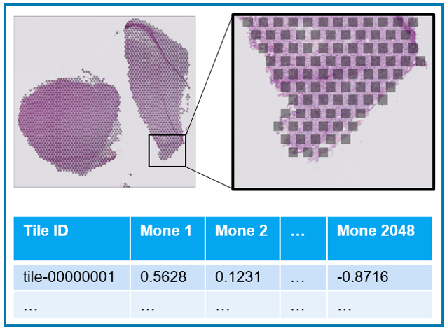

The default setting is to generate a grid that has the same geometry as 10x Visium Slide, except that tiles are set to be square instead of the round shape of ST spots. In this default setting, tiles are not covering the image entirely. Users can change grid parameters in the `analysis.config` file.

    

Inspired by SAMPLER work, the imaging feature extraction is done in multiple scales in a single pipeline run. 

    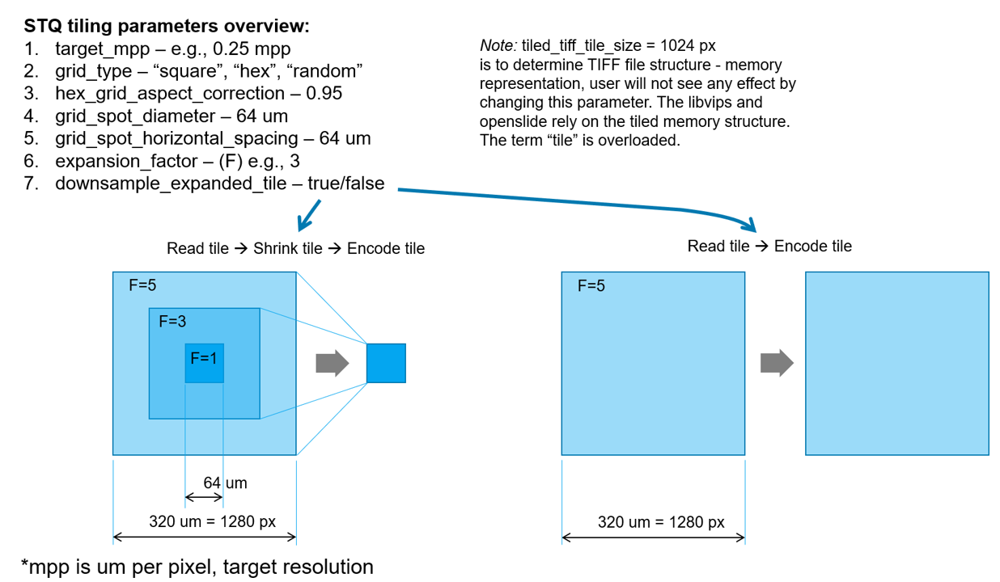

> *Publication:* Patience Mukashyaka, Todd B. Sheridan, Ali Foroughi pour, and Jeffrey H. Chuang. SAMPLER: unsupervised representations for rapid analysis of whole slide tissue images. EBioMedicine. 2024 Jan;99:104908. doi: 10.1016/j.ebiom.2023.104908. Epub 2023 Dec 14. PMID: 38101298; PMCID: PMC10733087.

There is also an experimental option for subtiling of the tiles for imaging feature extraction.

    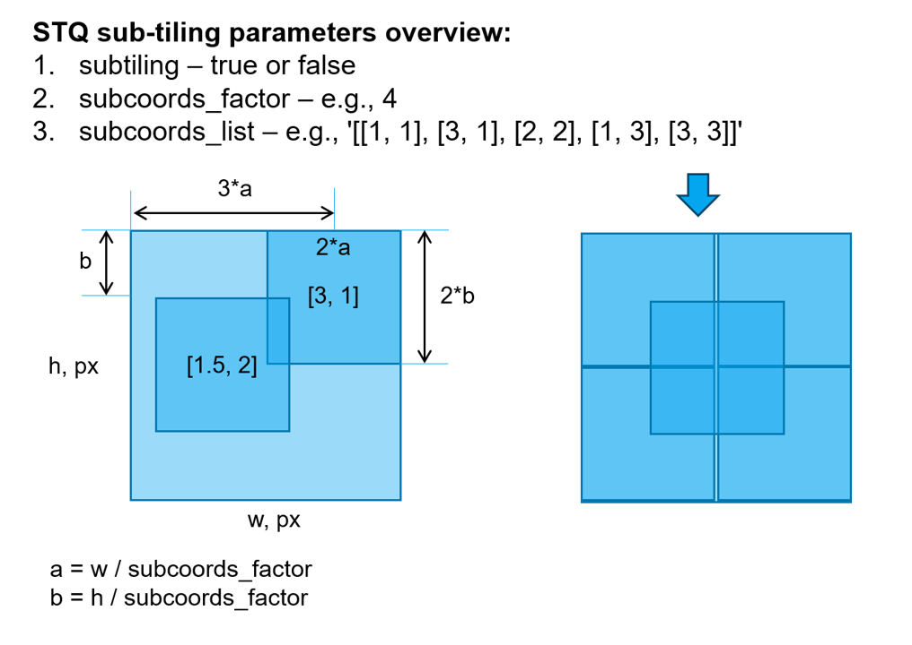

7. **`CTransPath, UNI, CONCH`**

CTransPath (https://github.com/Xiyue-Wang/TransPath) is a Transformer-based Unsupervised Contrastive Learning for Histopathological Image Classification. 

> *Publication:* Xiyue Wang, Sen Yang, Jun Zhang, Minghui Wang, Jing Zhang, Wei Yang, Junzhou Huang, Xiao Han. Transformer-based unsupervised contrastive learning for histopathological image classification. Med Image Anal. 2022 Oct;81:102559. doi: 10.1016/j.media.2022.102559. Epub 2022 Jul 30. PMID: 35952419.

UNI (https://huggingface.co/MahmoodLab/UNI) 

> *Publication:* Chen RJ, Ding T, Lu MY, Williamson DFK, Jaume G, Song AH, Chen B, Zhang A, Shao D, Shaban M, Williams M, Oldenburg L, Weishaupt LL, Wang JJ, Vaidya A, Le LP, Gerber G, Sahai S, Williams W, Mahmood F. Towards a general-purpose foundation model for computational pathology. Nat Med. 2024 Mar;30(3):850-862. doi: 10.1038/s41591-024-02857-3. Epub 2024 Mar 19. PMID: 38504018; PMCID: PMC11403354.

CONCH (https://huggingface.co/MahmoodLab/CONCH)

> *Publication:* Lu MY, Chen B, Williamson DFK, Chen RJ, Liang I, Ding T, Jaume G, Odintsov I, Le LP, Gerber G, Parwani AV, Zhang A, Mahmood F. A visual-language foundation model for computational pathology. Nat Med. 2024 Mar;30(3):863-874. doi: 10.1038/s41591-024-02856-4. Epub 2024 Mar 19. PMID: 38504017; PMCID: PMC11384335.

Both UNI and CONCH checkpoints download require User registration and agreement to the use restrictions. Download the `pytorch_model.bin` checkpoints and adjust the pipleine parameters accordingly.

8. **`HoVer-Net`** (https://github.com/vqdang/hover_net)

HoVer-Net nuclear segmentation and classification inference step was originally designed for GPU devices, but in our pipeline, is optimized for CPU. This pipeline step is computationally demanding.

> *Publication:* Simon Graham, Quoc Dang Vu, Shan E Ahmed Raza, Ayesha Azam, Yee Wah Tsang, Jin Tae Kwak, and Nasir Rajpoot, HoVer-Net: Simultaneous Segmentation and Classification of Nuclei in Multi-Tissue Histology Images, Medical Image Analysis, Volume 58, December 2019, 101563.

The inference calculation is carried out on the masked region (the white region is the tissue in the example below). The whole slide image is split into chunks; each chunk is split into tiles for segmentation. Ultimately HoVer-Net inference step produces a list of nuclear boundaries and assigned labels by using a pre-trained convolutional neural network (CNN) model on the PankNuke dataset, a dataset containing nearly 200,000 nuclei from 19 tissues from diverse cancer types that has undergone clinical annotation in a semi-automated manner and quality control by clinicians.

> *Publication:* Jevgenij Gamper, Navid Alemi Koohbanani, Ksenija Benes, Simon Graham, Mostafa Jahanifar, Seyyed Ali, Khurram, Ayesha Azam, Katherine Hewitt, and Nasir Rajpoot, PanNuke Dataset Extension, Insights and Baselines, arXiv:2003.10778v7 [eess.IV] 22 Apr 2020.

In-tissue mask:

    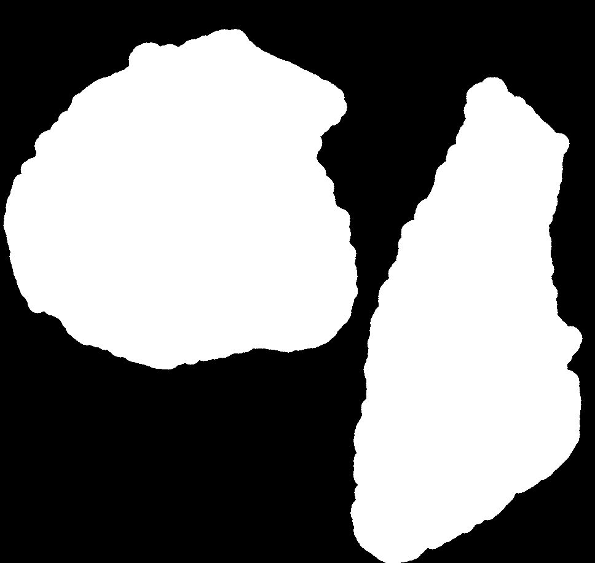

> ***Note*** The PanNuke dataset and the derived weights for HoVer-Net is licensed under Attribution-NonCommercial-ShareAlike 4.0 International.

9. **`StarDist`** (https://github.com/stardist/stardist)

StarDist is a method for the detection of star-convex-shaped objects from images. We use a pre-trained StarDist 2D model generated by the developers of StarDist.

10. **`DeepFocus`** (https://github.com/cialab/DeepFocus)

DeepFocus a deep learning based software called which can automatically detect and segment blurry areas in digital whole slide images (WSI).

> *Publication:* Caglar Senaras, M. Khalid Khan Niazi, Gerard Lozanski, Metin N. Gurcan (2018) DeepFocus: Detection of out-of-focus regions in whole slide digital images using deep learning. PLoS ONE 13(10): e0205387. https://doi.org/10.1371/journal.pone.0205387

10. **`scanpy`** (https://github.com/scverse/scanpy)

A representative scale of imaging features as well as nuclear morphometric features are processed in scanpy framework and visualized. Below is the example WSI from PeCan collection where imaging features of tiles are clustered at scale F=2.

https://pecan.stjude.cloud/histology/sample/SJHGS012410_X1#zoom1=2.9859839999999997&x1=0.9020688782830134&y1=0.08206838921811285

    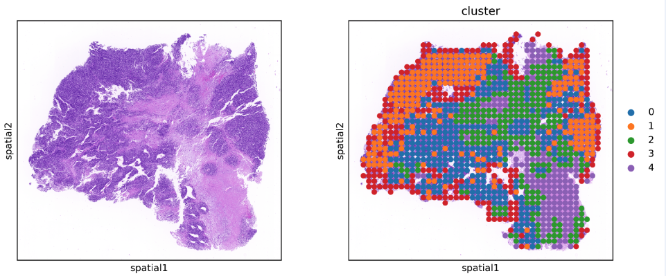

## Nextflow pipeline data flow

Execution of the pipeline and data flow through processes enable generating the Directed Acyclic Graph (DAG). The inputs and outputs are interconnected with the logic encoded by or nextflow pipeline. The DAGs represent a snapshot (or analysis trace) based on user-specified or default pipeline parameters. Below are the DAGs for the three analysis routes: two references, one reference, and an arbitrary grid:

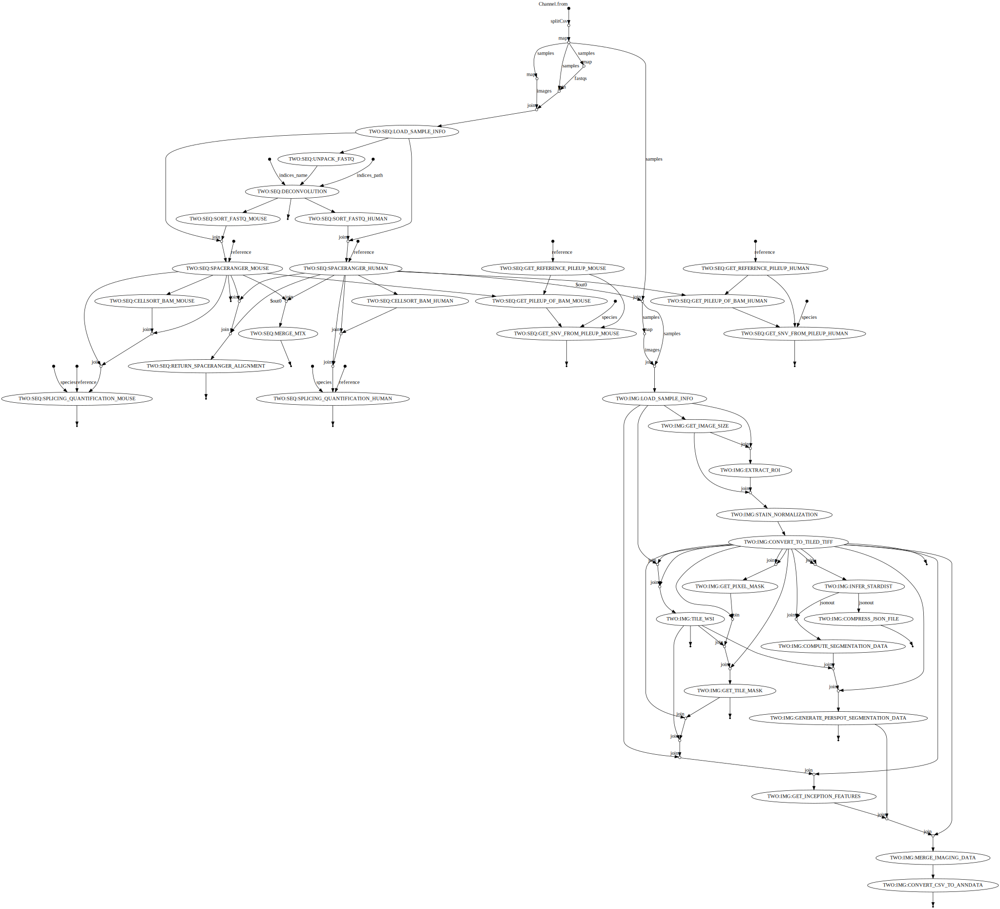

Directed Acyclic Graph for one-reference workflow

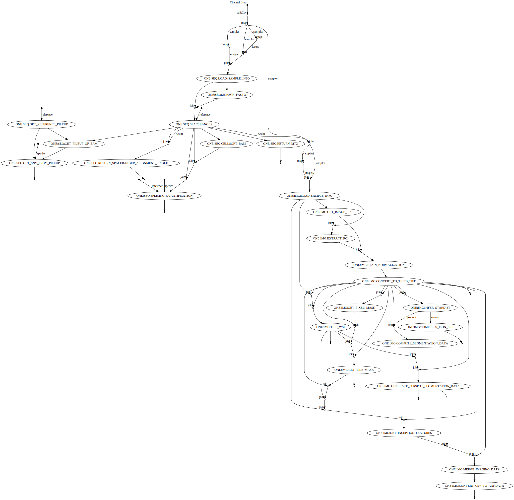

Directed Acyclic Graph for arbitrary grid workflow

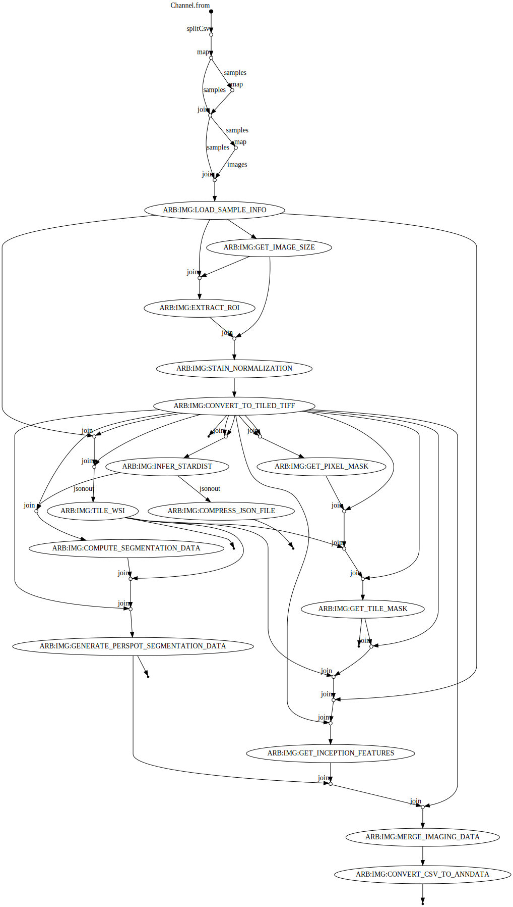

> ***Note*** DAG is generated during each pipeline run and is determined by the configuration and input parameters of the pipeline. For example, if specific optional processes are toggled "off," those processes and relevant graph connections will not show in the DAG.

## Nextflow pipeline resources

Our pipeline enables detailed tracing of resource usage. The run HTML report in the `pipeline_info` directory contains the time and resources spent by each process and each sample. A DAG and detailed raw execution trace are also generated in `pipeline_info` upon a successful pipeline run.

Example of CPU usage by various processes in the pipeline. A screenshot from the HTML report shows that SPACERANGER_HUMAN was the most CPU-intensive step in this example run:

    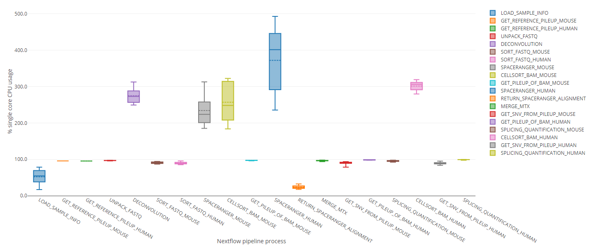

## Temporary files

The Nextflow pipeline is designed to cache each step in the work directory, path to which is specified when the pipeline is invoked. The temporary files can take a large amount of storage space. After the pipeline runs are completed for all necesary analysis routes, the user has to remove the temporary files.

#### Glossary of Terms:
+ STQ - Spatial Transcriptomics Quantification
+ WSI - Whole Slide Image
+ HPC - High-Performance Computer
+ VIPS - open source toolset for image processing (IP), based on libvips. V stands for "vf", the first version of VIPS GUI in SunView
+ TF - TensorFlow
+ HoVer-Net - Horizontal and vertical distances prediction network
+ FF - Flash Frozen
+ FFPE - Formalin-Fixed Paraffin-Embedded
+ DAG - Directed Acyclic Graph
+ JSON - JavaScript Object Notation
+ CPU - Central Processing Unit
+ GPU - Graphical Processing Unit
+ CNV - Copy Number Variation
+ BAM - Binary sequence Alignment Map
+ mpp - microns per pixel
+ CNV - Copy Number Variation
+ SNV - Single Nucleotide Variant
+ BAF - B-allele frequency
+ YACC - Yet Another Compiler-Compiler
+ ST - Spatial Transcriptomics
+ Full-resolution image - capture area image supplied to SpaceRanger, e.g., 30000 x 30000 pixels
+ Low-resolution image - downsampled full-resolution capture area image, e.g., 600 x 600 pixels
+ High-resolution image - downsampled full-resolution capture area image, e.g., 2000 x 2000 pixels
