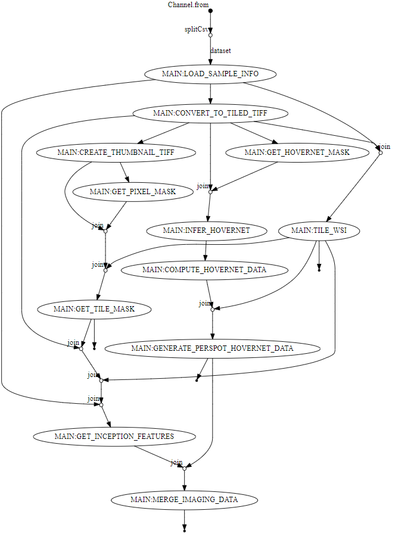

# Grid-Aware Imaging Feature Extraction pipeline

- [Overview](#overview)
- [Motivation](#Motivation)
- [Running the piepline](#running-the-piepline)
- [External tools used in the pipeline](#external-tools-used-in-the-pipeline)
  * Inception v3
  * HoVer-Net
- [Nextflow pipeline data flow](#nextflow-pipeline-data-flow)
- [Nextflow pipeline resources](#nextflow-pipeline-resources)

## Overview

This repository contains the source code of the nextflow implementation of the analysis of whole slide images and spatial transcriptomics images data processing developed at [The Jackson Laboratory](https://www.jax.org/ "The Jackson Laboratoty"). The overview of the pipeline is shown below. 

    

## Motivation

Most of the steps implemented in our pipeline are computationally expensive and must be carried out on high-performance computer (HPC) systems. The most computationally intensive pipeline step is nuclear morphometrics data extraction. The pipeline generates a standardized set of files that can be used on a regular laptop for downstream analysis using R-based Seurat of Python-based Scanpy or any other available environments.

## Running the piepline

##### Prerequisites
+ HPC environment with sufficient CPU and RAM and temporary storage resources

Processing 1 sample requires approximately 70 CPU hours of computing time. Most of the processes need 1 CPU while HoVer-Net requires 10 CPUs as specified in the `nexflow.config` file. The temporary storage requires roughly 50 GB per sample for the pipeline to run.

+ Nextflow 

      https://www.nextflow.io/docs/latest/getstarted.html#installation

+ Singularity 

      https://docs.sylabs.io/guides/3.0/user-guide/installation.html

+ The pipeline source code  (this repository)

	  mkdir my-piepline-run
      cd my-piepline-run
	  git clone https://github.com/TheJacksonLaboratory/st-wsi-analysis.git
      cd st-wsi-analysis

+ Singularity software containers used in this pipeline

The singularity containers used in our pipeline can be downloaded or built with the definition `*.def` files and recipes contained in the directory `assets`.

##### Sample sheet

The pipeline is designed to take one or more samples and process them in parallel. The sample sheet must have a `csv` format and must contain a header as shown below:

| sample | image | grid |
|------|------|------|
| sample_A   | path/to/fullres/image1.tiff   |     |
| sample_B   | path/to/fullres/image2.tiff   | /path/to/spaceranger/output/sampleB/spatial/  |
| sample_C   | path/to/fullres/image3.tiff   |     |
| ...  | ...  | ...  |

> ***Tip*** Column headers may be named differently but preserving the order, i.e. the first column contains sample identifiers, the second column points to a path of directories where the sample image is stored, the third column points to a path of directories where the sample spatial image alignment is stores. The value in the third column can be empty if the WSI is not from 10x Visium Spatial Gene Expression Slide.

> ***Tip*** Sample identifiers in column 1 must be unique. The output directory will contain sub-directories named by the sample identifiers. The pipeline output reports are also based on these identifiers.

##### Configure the pipeline

Edit file `nextflow.config` to specify paths to singularity containers. If necessary, adjust any of the resources allowed to be consumed by processes.

Check the defaults or edit the file `conf/analysis.config` to adjust any customizable parameters.

Edit file `run.sh` to modify the three lines:
+ samplesheet="/path/to/samplesheet.csv"
+ workdir="/fastscratch/[jaxuser]/some_work_run"
+ outdir="/path/to/results_my_analysis"

> ***Tip*** Use unique paths for each run to make the cleanup of temporary files easier. This strategy allows the separation of pipeline run statistics and output samples.

> ***Note*** `workdir` must point to a device with a large storage volume and fast I/O access capability.

##### Run the pipeline

        ./run.sh

The command above submits the pipeline to the HPC slurm system, which creates a low resource but long wall time job which manages the nextflow pipeline run. Nextflow manages all the pipeline processes and monitors the execution progress. Users can periodically monitor the contents of the `slurm-*.out` file to see progress.

> ***Tip*** Submitting via srun interactive session will show beautifully updated progress of the pipeline run. We do not recommend using srun for our pipeline, since network interruption will cause the ssh connection to drop and the pipeline to fail. In such an unfortunate case user can run the pipeline again, however, any previously unfinished processes will restart, while all finished processes resume from cached data.

## External tools used in the pipeline

1. **`Inception v3`** (https://keras.io/api/applications/inceptionv3/)

**Need a citation to the inception script**

    

2. **`HoVer-Net`** (https://github.com/vqdang/hover_net)

    

In-tissue mask:

    
    

## Nextflow pipeline data flow

Execution of the pipeline and flow of data through processes enable generating the Directed Acyclic Graph (DAG). The inputs and outputs are interconnected with the logic encoded by or nextflow pipeline.

    

> ***Note*** DAG is generated during each pipeline run and is determined by the configuration and input parameters of the pipeline. For example, if certain optional processes are toggled "off" then those processes and relevant graph connections will not show in the DAG.

## Nextflow pipeline resources

Our pipeline enables detailed tracing of resource usage. The run HTML report in the `pipeline_info` directory contains the time and resources spent by each process and each sample.
